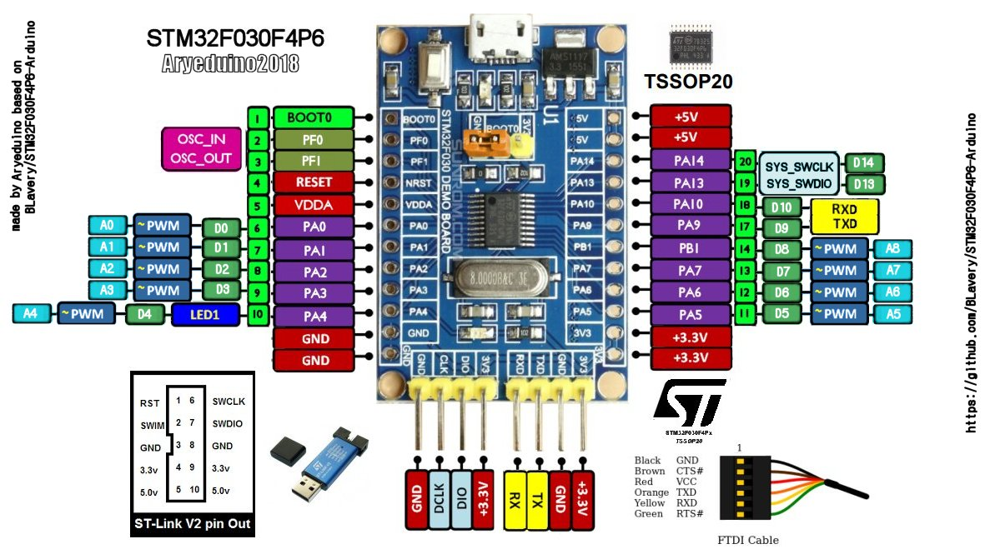

# STM32F030 blue pill

* самая дешевая отладочная плата на 32хбитном микроконтроллере
* [[Cortex-M0]] [[STM32F030F4P6]]
  * 48 MHz
  * PROM Flash 16k x 8
  * RAM 4k x 8
  * АЦП 11x12bit
  * напряжение питания: 2.4…3.6 в
  * рабочая температура: -40…+85c
  * корпус: tssop-20 (0.173, 4.40мм)

